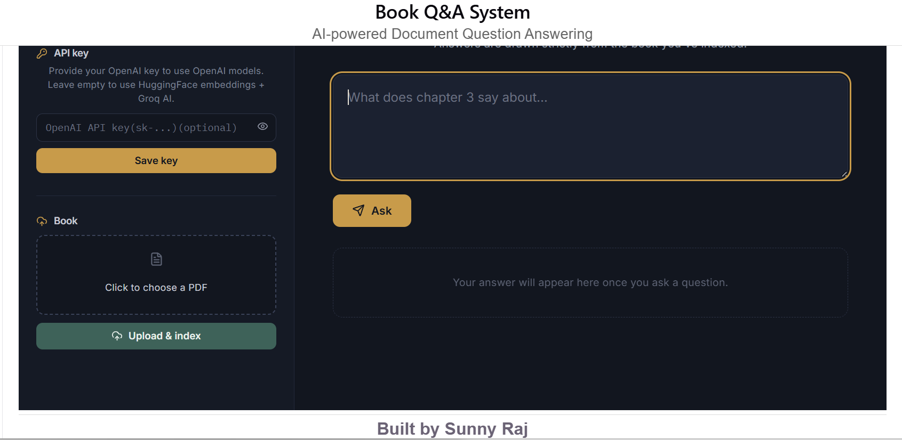

# 📚 AI-powered RAG system for grounded PDF question answering.  

  ## [Deployment Link](https://ai-powered-rag-system-for-grounded.vercel.app/)

An AI-powered Retrieval-Augmented Generation (RAG) application that allows users to upload PDF documents, index their contents using vector embeddings, and ask natural language questions grounded strictly in the uploaded document.

The project combines **semantic search**, **LLMs**, and **vector embeddings** to generate accurate, context-aware answers while preventing hallucinations.

---

## 🚀 Features

- 📄 Upload PDF documents
- ✂️ Automatic document chunking
- 🧠 Semantic embeddings using Hugging Face or OpenAI
- 🔎 Vector similarity search using Cosine Similarity
- 🤖 AI-powered question answering
- 📚 Answers grounded only in uploaded documents
- 🔑 Bring Your Own API Key (OpenAI)
- ⚡ Default free mode using Hugging Face + Groq
- 🎨 Clean responsive React frontend
- ☁️ Ready for cloud deployment

---

# 🏗️ Architecture

```text
                PDF Upload
                     │
                     ▼
              PDF Text Extraction
                     │
                     ▼
              Document Chunking
                     │
                     ▼
          Embedding Generation
                     │
     ┌───────────────┴────────────────┐
     │                                │
Default Mode                    User API Key
(HuggingFace)                     (OpenAI)
     │                                │
     └───────────────┬────────────────┘
                     ▼
              Vector Storage
                     │
                     ▼
             User Question
                     │
                     ▼
         Question Embedding
                     │
                     ▼
        Cosine Similarity Search
                     │
                     ▼
         Top Relevant Chunks
                     │
                     ▼
              Prompt Builder
                     │
     ┌───────────────┴────────────────┐
     │                                │
 Default Answer                  OpenAI Answer
      (Groq)                       (GPT)
     │                                │
     └───────────────┬────────────────┘
                     ▼
              Final Answer
```

---

# 🛠️ Tech Stack

## Frontend

- React
- Vite
- Lucide React
- Fetch API

---

## Backend

- Node.js
- Express.js
- Multer
- pdf-parse
- Axios

---

## AI Stack

### Embeddings

- Hugging Face Inference API
- OpenAI Embeddings (Optional)

### LLM

- Groq
- OpenAI GPT (Optional)

---

## Retrieval

- Custom In-Memory Vector Store
- Cosine Similarity Search

---

# 📂 Project Structure

```text
Book-Grounded-AI
│
├── frontend
│   ├── src
│   ├── public
│   └── package.json
│
├── backend
│   ├── controllers
│   ├── services
│   ├── routes
│   ├── uploads
│   ├── .env
│   ├── server.js
│   └── package.json
│
└── README.md
```

---

# ⚙️ Installation

## Clone Repository

```bash
git clone https://github.com/sunny-raj-sah/AI-powered-RAG-system-for-grounded-PDF-question-answering.git

cd AI-powered-RAG-system-for-grounded-PDF-question-answering.
```

---

# Backend

```bash
cd backend

npm install

npm run dev
```

---

# Frontend

```bash
cd frontend

npm install

npm run dev
```

---

# 🔐 Environment Variables

Backend `.env`

```env
PORT=5000

HUGGINGFACE_API_KEY=your_huggingface_key

GROQ_API_KEY=your_groq_api_key

GROQ_MODEL=llama-3.1-8b-instant
```

Frontend `.env`

```env
VITE_API_URL=http://localhost:5000
```

---

# 🧠 How It Works

## 1. Upload PDF

The user uploads any PDF document.

↓

## 2. Text Extraction

The backend extracts text using:

```
pdf-parse
```

↓

## 3. Chunking

The document is divided into overlapping chunks.

Example

```text
Chunk 1

Chunk 2

Chunk 3

Chunk 4
```

↓

## 4. Embedding Generation

Each chunk is converted into a vector using

- Hugging Face (default)
- OpenAI (optional)

↓

## 5. Vector Storage

Vectors are stored with metadata.

```text
Embedding

↓

Original Text

↓

Chunk Number
```

↓

## 6. Ask Question

The user's question is converted into an embedding.

↓

## 7. Vector Search

Cosine Similarity finds the most relevant chunks.

↓

## 8. Prompt Construction

The retrieved chunks are used to build the prompt.

↓

## 9. AI Answer

If using default mode

```
Groq
```

If using OpenAI API Key

```
OpenAI GPT
```

↓

## 10. Final Response

Only information present inside the uploaded document is used to answer.

---

# 🔑 Bring Your Own API Key

Users can optionally provide their own OpenAI API Key.

### Without API Key

Embeddings

```
Hugging Face
```

Answer Generation

```
Groq
```

---

### With API Key

Embeddings

```
OpenAI
```

Answer Generation

```
OpenAI GPT
```

---

# 📌 API Endpoints

## Upload PDF

```
POST /api/book/upload
```

Headers

```http
x-api-key: sk-xxxxxxxx (optional)
```

Body

```
multipart/form-data
```

Field

```
book
```

---

## Ask Question

```
POST /api/qa/ask
```

Headers

```http
Content-Type: application/json

x-api-key: sk-xxxxxxxx (optional)
```

Body

```json
{
    "question":"Who is Sunny Raj?"
}
```

---

# 🌟 Future Improvements

- Pinecone Integration
- ChromaDB
- FAISS
- PostgreSQL + pgvector
- Multi-document Search
- Chat History
- Conversation Memory
- Citation Generation
- Streaming Responses
- OCR Support
- DOCX Support
- Image Extraction
- DDR (Detailed Document Report) Generator
- Authentication
- User Dashboard
- Deployment with Docker
- Redis Caching

---

# 📸 Screenshots

Add screenshots here.

Example:

 
 
 

---

# 🚀 Deployment

Frontend

- Vercel

Backend

- Render

---

# 👨‍💻 Author

**Sunny Raj**

Backend Engineer • Full Stack Engineer • AI Engineer

- GitHub: https://github.com/sunny-raj-sah
- LinkedIn:https://www.linkedin.com/in/sunny-raj-885588313/

---

# ⭐ If you found this project useful

Please consider giving the repository a **Star ⭐**.
