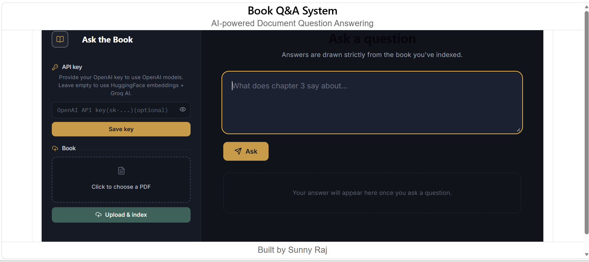
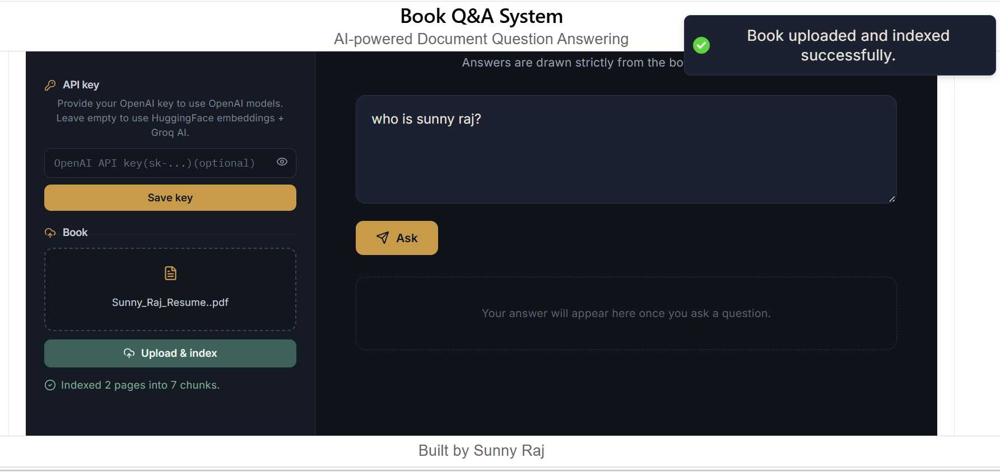
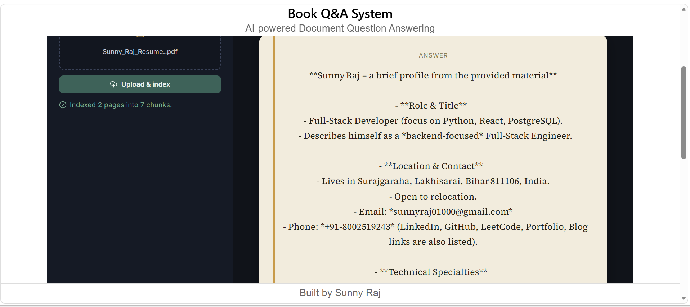
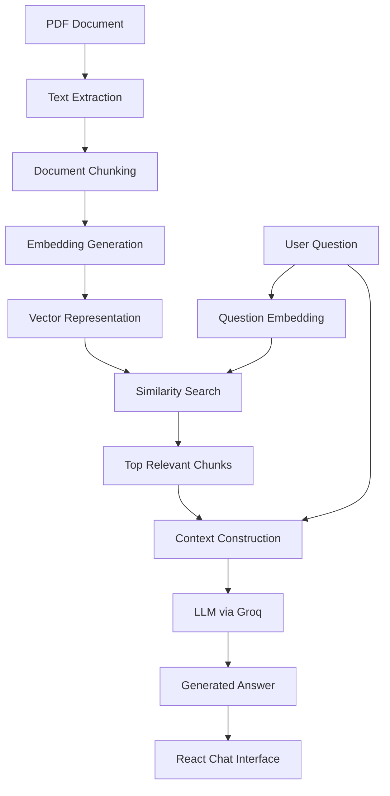

# 📚 AI-Powered RAG System for Grounded PDF Question Answering

An AI-powered document question-answering system that uses **Retrieval-Augmented Generation (RAG)** to answer questions from PDF documents using retrieved document context rather than relying only on the language model's internal knowledge.

The system processes a large PDF, converts its content into searchable chunks, generates embeddings for semantic retrieval, and sends the most relevant context to an LLM to produce grounded answers.

[](https://ai-powered-rag-system-for-grounded.vercel.app/)
[](https://github.com/sunny-raj-sah/AI-powered-RAG-system-for-grounded-PDF-question-answering)

---

## 🚀 Live Demo

**Live Application:**
https://ai-powered-rag-system-for-grounded.vercel.app/

**Repository:**
https://github.com/sunny-raj-sah/AI-powered-RAG-system-for-grounded-PDF-question-answering

> **Note:** The application is designed as a demonstration of a RAG-based document question-answering workflow. Provider availability and free-tier deployment behavior can affect response time.

---
## 📸 Screenshots

### Main Interface



### Question Answering




### Grounded Response



## 🎯 Problem

Large PDF documents contain useful information, but finding a specific answer manually can be slow and inefficient.

A conventional LLM chatbot also has an important limitation: it may generate an answer from its pretrained knowledge even when the requested information is not present in the uploaded document.

This project addresses that problem by using **Retrieval-Augmented Generation**:

```text
PDF Document
     ↓
Text Extraction
     ↓
Document Chunking
     ↓
Embedding Generation
     ↓
Semantic Retrieval
     ↓
Relevant Context
     ↓
LLM
     ↓
Grounded Answer
```

The goal is to make answers more closely tied to the contents of the source document.

---

## ✨ Key Features

* Ask natural-language questions about a PDF document
* Semantic retrieval using vector embeddings
* Retrieval-Augmented Generation (RAG)
* Large-document processing
* Context-aware answer generation
* React-based interactive chat interface
* Node.js-based backend API
* Hugging Face embedding models
* Groq-powered LLM generation
* Responsive web interface
* Fallback handling for AI/API failures

---

## 🧠 Why RAG?

A standard LLM request looks like:

```text
User Question
      ↓
     LLM
      ↓
   Answer
```

The model may answer using information learned during training.

This project instead follows:

```text
User Question
      ↓
   Embedding
      ↓
Vector Similarity Search
      ↓
Relevant Document Chunks
      ↓
Context + Question
      ↓
     LLM
      ↓
Grounded Answer
```

The retrieved document content becomes the basis for answer generation.

---

# 🏗️ System Architecture



---

# 🔄 RAG Pipeline

## 1. Document ingestion

The PDF is processed and its textual content is extracted.

For large documents, the content is divided into smaller chunks so that relevant sections can be retrieved efficiently.

---

## 2. Chunking

The extracted content is divided into manageable text segments.

Conceptually:

```text
Large PDF
   ↓
Pages / Text
   ↓
Smaller Chunks
   ↓
Embeddings
```

Chunking improves retrieval because the system can search for relevant sections instead of passing the entire document to the LLM.

---

## 3. Embeddings

Each document chunk is converted into a numerical vector representation using an embedding model.

Conceptually:

```text
"Newton's second law..."
          ↓
     Embedding Model
          ↓
[0.124, -0.083, 0.442, ...]
```

The same process is applied to the user's question.

---

## 4. Semantic retrieval

The question embedding is compared with document chunk embeddings to identify the most relevant content.

```text
Question
   ↓
Question Embedding
   ↓
Similarity Search
   ↓
Top Relevant Chunks
```

This allows the application to retrieve content based on semantic meaning rather than exact keyword matching alone.

---

## 5. Context construction

The retrieved chunks are combined with the user's question to create the context sent to the language model.

```text
Retrieved Context
        +
User Question
        ↓
Prompt
```

---

## 6. Answer generation

The contextual prompt is sent to the configured LLM through Groq.

The model generates the final response using the retrieved information as context.

```text
Relevant Context
      +
Question
      ↓
Groq LLM
      ↓
Answer
```

---

# 📊 Project Scale

The project was tested against a large **DC Pandey PDF containing approximately 637 pages**.

The document was processed into approximately **1,600+ searchable chunks**, allowing the system to retrieve smaller relevant sections instead of sending the entire document to the model for every question.

This makes the project a practical demonstration of RAG over a non-trivial document rather than a small toy dataset.

---

# 🛠️ Tech Stack

| Layer              | Technology                            |
| ------------------ | ------------------------------------- |
| Frontend           | React.js                              |
| Backend            | Node.js                               |
| API Layer          | Express.js                            |
| AI Architecture    | Retrieval-Augmented Generation (RAG)  |
| Embeddings         | Hugging Face embedding models         |
| LLM                | Groq                                  |
| Document Source    | PDF                                   |
| Semantic Retrieval | Vector embeddings / similarity search |
| Deployment         | Vercel                                |
| Development        | Git, GitHub, Postman                  |

---

# 💻 Application Flow

The user interacts with the system through a chat-style interface.

```text
1. Open application
        ↓
2. Ask a question
        ↓
3. Backend receives the question
        ↓
4. Question is converted into an embedding
        ↓
5. Relevant document chunks are retrieved
        ↓
6. Retrieved context is passed to the LLM
        ↓
7. LLM generates the answer
        ↓
8. Answer is displayed in the React UI
```

---

# 🔌 High-Level API Flow

The frontend communicates with the backend rather than directly implementing the complete RAG pipeline.

```text
React Client
     ↓
Backend API
     ↓
Question Processing
     ↓
Embedding / Retrieval
     ↓
Context Construction
     ↓
LLM Request
     ↓
Response
     ↓
React UI
```

This separation keeps the user interface independent from the AI processing layer.

---

# 🧩 Engineering Challenges

### Large-document retrieval

Processing a 637-page document requires more than simply sending the complete PDF contents to an LLM.

The document therefore needs to be transformed into smaller searchable units before question answering.

### Context selection

Providing too much context can increase token usage and introduce irrelevant information.

Providing too little context can cause the model to miss important information.

The retrieval layer therefore becomes an important part of answer quality.

### AI provider reliability

LLM providers and models can change availability over time.

The application therefore needs to handle provider/API errors gracefully rather than assuming every request will succeed.

### Deployment constraints

Free-tier hosting can introduce cold starts, API limits, and runtime constraints that differ from local development.

---

 ## 📁 Project Structure

```text
AI-Powered-RAG-System/
│
├── backend/
│   ├── src/
│   │   ├── controllers/
│   │   ├── middlewares/
│   │   ├── routes/
│   │   └── services/
│   │
│   ├── uploads/
│   │
│   ├── app.js
│   ├── server.js
│   ├── package.json
│   └── package-lock.json
│
├── frontend/
│   ├── public/
│   │   └── favicon.svg
│   │
│   ├── src/
│   │   ├── components/
│   │   ├── App.css
│   │   ├── App.jsx
│   │   ├── index.css
│   │   └── main.jsx
│   │
│   ├── eslint.config.js
│   ├── index.html
│   ├── vite.config.js
│   ├── package.json
│   └── package-lock.json
│
├── docs/
│   └── screenshots/
│       ├── home.png
│       ├── question-answer.png
│       └── answer.png
│
└── Readme.md
```

### Directory Overview

| Directory / File           | Purpose                                                               |
| -------------------------- | --------------------------------------------------------------------- |
| `backend/src/controllers/` | Handles API request and response logic                                |
| `backend/src/middlewares/` | Handles request middleware such as validation or authentication logic |
| `backend/src/routes/`      | Defines API endpoints and route mappings                              |
| `backend/src/services/`    | Contains business logic and RAG-related processing                    |
| `backend/uploads/`         | Stores uploaded PDF documents during runtime                          |
| `backend/app.js`           | Configures the backend application                                    |
| `backend/server.js`        | Starts the backend server                                             |
| `frontend/src/components/` | Contains reusable React components                                    |
| `frontend/src/App.jsx`     | Main frontend application component                                   |
| `frontend/src/main.jsx`    | Frontend entry point                                                  |
| `frontend/public/`         | Static frontend assets                                                |
| `docs/screenshots/`        | Project screenshots used in documentation                             |
| `backend/package.json`     | Backend dependencies and npm scripts                                  |
| `frontend/package.json`    | Frontend dependencies and npm scripts                                 |
| `Readme.md`                | Main project documentation                                            |

---

# 🔐 Security Considerations

AI applications require particular attention to secret management.

Provider credentials such as:

```text
GROQ_API_KEY
HUGGINGFACE_API_KEY
```

should remain server-side and should never be committed to the repository.

Environment variables should be used for configuration:

```text
.env
```

and sensitive files should be excluded through:

```text
.gitignore
```

The deployed application should also validate incoming requests and avoid exposing provider credentials through the frontend.

---

# 🧪 Testing & Evaluation

A useful next step for the project is to evaluate retrieval and answer quality using a fixed question set.

For example:

```text
Question
   ↓
Expected source section
   ↓
Retrieved chunks
   ↓
Generated answer
   ↓
Evaluation
```

Useful evaluation metrics include:

* Retrieval Hit Rate
* Recall@K
* Mean Reciprocal Rank (MRR)
* Answer relevance
* Faithfulness / groundedness
* Response latency

This provides a measurable way to improve the retrieval pipeline rather than relying only on manual testing.

---

# 📈 Future Improvements

The current architecture can be extended with:

* Source/page citations for every answer
* Multi-document support
* Persistent vector storage
* Document-specific knowledge bases
* User authentication
* Conversation history
* Retrieval evaluation dashboard
* Hybrid keyword + semantic search
* Re-ranking of retrieved chunks
* Streaming LLM responses
* Rate limiting
* File validation and upload limits
* AI response monitoring and logging

---

# 🎥 Suggested Demo Flow

For a project demonstration, the recommended flow is:

```text
Upload / Load Document
        ↓
Ask a factual question
        ↓
Show retrieved information
        ↓
Display generated answer
        ↓
Ask a follow-up question
        ↓
Demonstrate another retrieval case
```

A short screen recording of this flow can be added to the repository and portfolio case study.

---

# 🧠 What I Learned

This project helped me understand how a production-oriented RAG workflow is built beyond simply calling an LLM API.

Key areas explored:

* Document processing
* Text chunking
* Embedding generation
* Semantic retrieval
* Context construction
* LLM integration
* Backend API design
* React-to-backend communication
* Environment variable management
* AI application deployment
* Retrieval quality considerations

---

# 📌 Project Status

**Status:** Working prototype / deployed demonstration

The core RAG workflow is implemented and deployed. Further improvements are planned around evaluation, source citations, persistent document storage, security hardening, and production-grade retrieval.

---

# 👨‍💻 Author

**Sunny Raj**

Software Engineer | Backend | Full Stack | AI

* GitHub: https://github.com/sunny-raj-sah
* LinkedIn: https://www.linkedin.com/in/sunny-raj-885588313/
* Portfolio: https://portfolio-eight-vert-40.vercel.app/

---

## 🔗 Project Links

**Live Demo:**
https://ai-powered-rag-system-for-grounded.vercel.app/

**Source Code:**
https://github.com/sunny-raj-sah/AI-powered-RAG-system-for-grounded-PDF-question-answering

 
---

## ⭐ If you found the project useful

Consider starring the repository or exploring the implementation to learn more about Retrieval-Augmented Generation and grounded document question answering.
